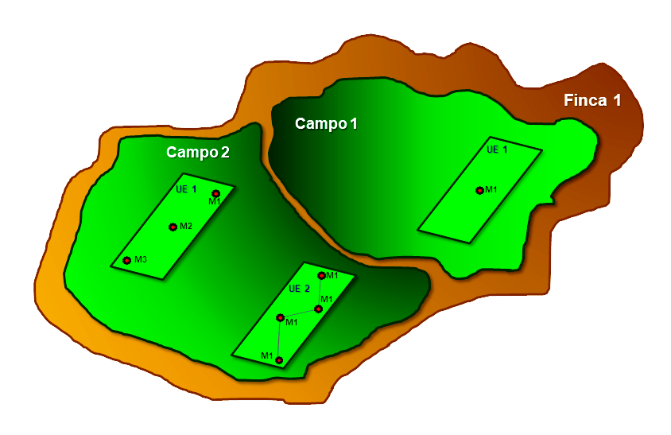

# Niveles de abstracción de la BD {-}

##### I.  Niveles de abstracción en la estructura considerada para diseñar la Base de datos sobre prácticas de manejo sostenible y aguas (PMSSA) e indicadores. {-}

***Figura 1.** Niveles de abstracción de la Base de datos.*

 
Como se muestra en la Figura 1, se consideraron 5 niveles anidados para separar los datos de los países, a lo cual llamamos niveles de abstracción, y que creemos útiles para encontrar una relación lógica que vaya desde niveles generales de información a mucho más detallados. Por lo tanto el nivel Proyecto envuelve al nivel Finca, esta contendrá el nivel Campo y estos últimos empaquetan a las Unidades de Evaluación (UE) y finalmente las Muestras puntuales de suelos con indicadores de productividad estarán y caracterizan las UE.
