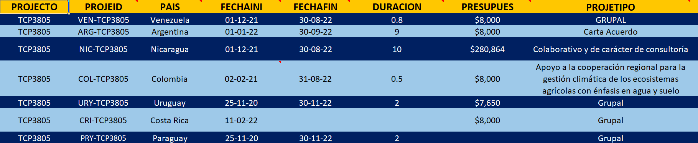

# Integración y normalización de los datos {-}

##### II.  Integración y normalización de los datos sobre prácticas e indicadores aportados por Argentina, Colombia, Costa Rica, Nicaragua, Paraguay, Uruguay y Venezuela. {-}

Se integraron los archivos excel PROTOCOLO DE MSS - RECSOIL, con la información de 7 países: Argentina, Colombia, Costa Rica, Nicaragua, Uruguay, Paraguay y Venezuela. 
 
Normalización y corrección de información, haciendo hincapié en :

* Lograr concordancia de los campos. 
* Reducción de nombres de los campos para que las tablas sean funcionales en la base de datos. 
* Corrección del formato de los campos (tipo numérico, texto, fecha, memo y moneda) para posibilitar futuros cálculos. 
* Lograr relaciones correctas entre los identificadores (ID) de Proyectos, Fincas, Campos, Unidades de evaluación y Muestras. 
* Homologación de coordenadas en el sistema de coordenadas Geográficas en grados decimales y datum WGS84. 
* Homologación de unidades de algunas de las propiedades (ejemplo superficies en ha o manzanas). 
* Establecer que columnas o campos contenían el término “Otros”, lo que se puede tomar como un posible indicador de la necesidad de ampliar la lista proporcionada de opciones en algunas variables.

La Figura 2 muestra un ejemplo de los datos integrados y normalizados. Ademas se puede descargar del enlace en el título de la Figura.

***Figura 2.** Hoja de cálculo excel con las tablas integradas y normalizadas.*
