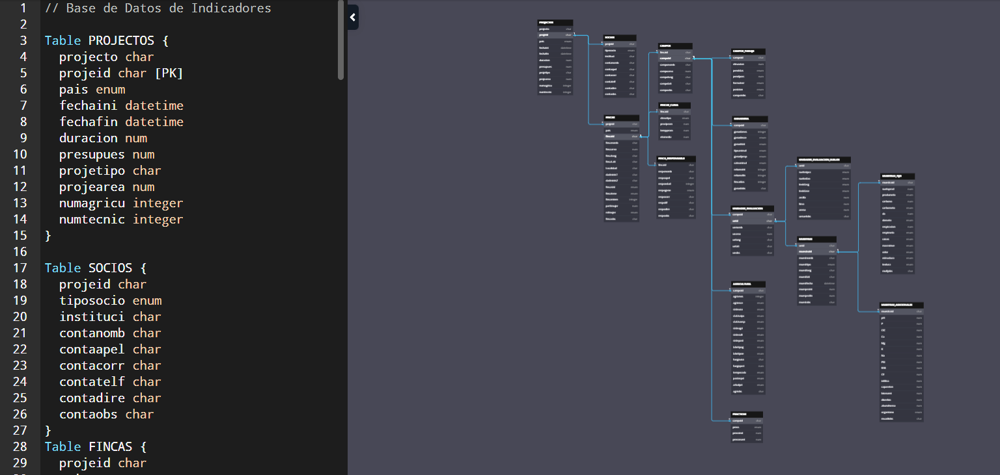
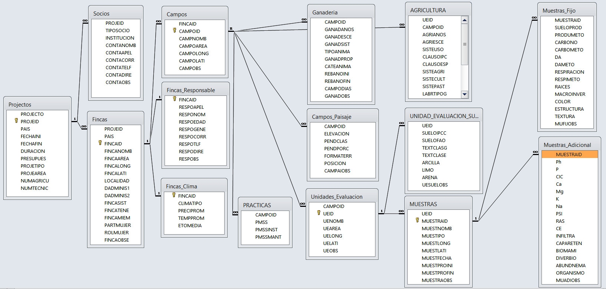

# Diagrama de Entidad - Relacion {-}

##### VI. Diseño del diagrama Entidad - Relación de la Base de datos sobre prácticas de manejo sostenible y aguas (PMSSA) e indicadores. {-}

Se diseñó la base de datos en un diagrama con la aplicación DBdiagram.io, exportable a diversos formatos de motores de base de datos. Como se muestra en las Figuras 3. El enlace del título de la figura puede enlazarlo al diagrama en la aplicación original.

 

***Figura 3.** Diseño de Base de datos en la aplicacion web dbdiagfram.io*

 

***Figura 4.** Tablas de diseño de Base de datos Indicadores.*
