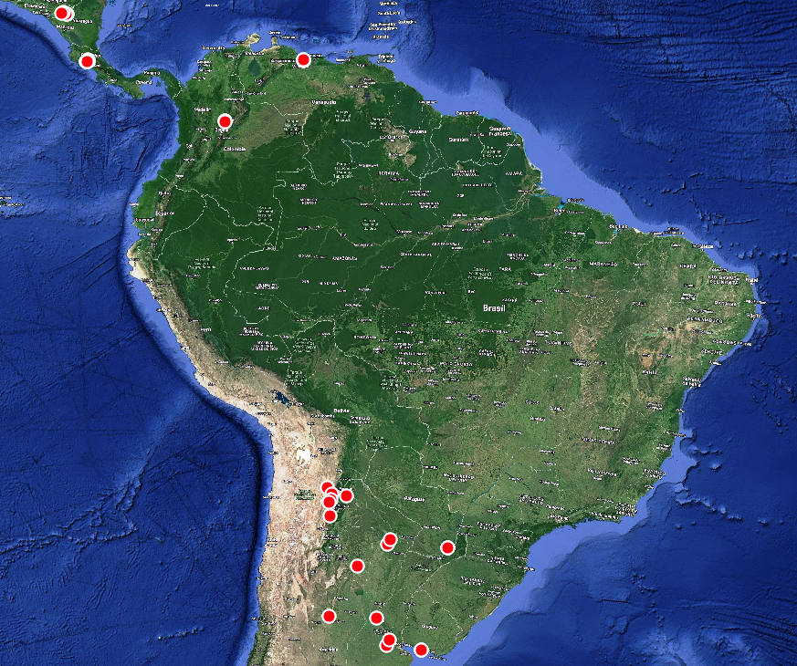

--- 
title: "BASE DE DATOS DE INDICADORES"
author: "FAO"
date: "`r Sys.Date()`"
site: bookdown::bookdown_site
documentclass: book
bibliography: [book.bib, packages.bib]
# url: your book url like https://bookdown.org/yihui/bookdown
# cover-image: path to the social sharing image like images/cover.jpg
description: |
  This is a minimal example of using the bookdown package to write a book.
  The HTML output format for this example is bookdown::gitbook,
  set in the _output.yml file.
link-citations: yes
github-repo: rstudio/bookdown-demo
---

# Introduccion {-}

 

Este documento tiene la finalidad de mostrar las actividades realizadas y elementos obtenidos hasta la fecha (Noviembre 2022), en la construcción de Base de Datos sobre prácticas de manejo sostenible y aguas (PMSSA) e indicadores.

A continuación se describen los avances logrados en la construcción de la base de datos.

I.  Niveles de abstracción en la estructura considerada para diseñar la Base de datos sobre prácticas de manejo sostenible y aguas (PMSSA) e indicadores.
II. Integración y normalización de los datos sobre prácticas e indicadores aportados por Argentina, Colombia, Costa Rica, Nicaragua, Paraguay, Uruguay y Venezuela.
III. Observaciones realizadas a los datos proporcionados por los diferentes países (Argentina, Colombia, Costa Rica, Nicaragua, Paraguay, Uruguay y Venezuela).
IV. Diseño del diagrama Entidad - Relación de la Base de datos sobre prácticas de manejo sostenible y aguas (PMSSA) e indicadores.
V. Análisis de condiciones de las muestras de suelos y su distribución espacial.